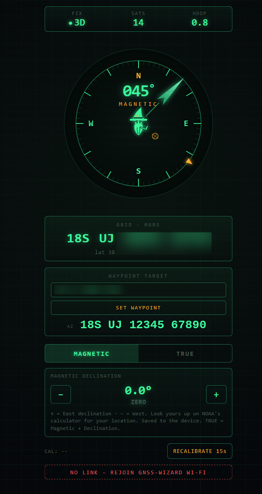

# GNSS Wizard HUD

A tactical GPS heads-up display running on an ESP32. It hosts its own Wi-Fi access point — no router needed. Connect any phone or tablet to the **GNSS-WIZARD** network, open a browser, and get a live compass, MGRS grid, satellite count, HDOP, and waypoint targeting.

---

## Features

- 📡 Live GPS fix, satellite count, and HDOP quality indicator
- 🧭 Magnetic compass with smooth needle animation
- 🗺️ Real-time MGRS grid coordinate display
- 🔁 Magnetic / True north toggle (with adjustable declination)
- ⚠️ Magnetic interference detection
- 💾 Declination and calibration saved to flash (survives power cycles)
- 📶 Standalone Wi-Fi AP — no router or internet required
- 🎯 Waypoint targeting — enter any lat/lon and get live azimuth, elevation, and range

---

## Hardware

| Component | Details |
|---|---|
| Microcontroller | ESP32-WROOM-32 (Dev Module) |
| GPS | ARK DAN L1/L5 (6-pin JST-GH, 38400 baud) |
| Magnetometer | IIS2MDC (I2C, address 0x1E) |

---

## Wiring

| GPS / Mag Pin | ESP32 Pin |
|---|---|
| 5V | VIN |
| GND | GND |
| GPS TX | GPIO 16 (RX2) |
| GPS RX | GPIO 17 (TX2) |
| SCL | GPIO 22 |
| SDA | GPIO 21 |

> **Note:** If heading reads -1 or is frozen, reseat the SDA/SCL solder joints.

---

## Required Library

Install via Arduino Library Manager:

- **TinyGPSPlus** by Mikal Hart

---

## Arduino IDE Settings

| Setting | Value |
|---|---|
| Board | ESP32 Dev Module |
| Upload Speed | 115200 |
| Partition Scheme | Default (or "No OTA (2MB APP / 2MB SPIFFS)" if binary is too large) |

> Hold the **BOOT** button during upload if the ESP32 won't connect.

---

## Usage

1. Flash `GNSS_Wizard_HUD_1.ino` to your ESP32
2. Power it on
3. On your phone or tablet, connect to the **GNSS-WIZARD** Wi-Fi network (no password)
4. Open a browser and go to `http://192.168.4.1`
5. On first boot, rotate the device in a level circle to calibrate the magnetometer

---

## Calibration

Press **RECALIBRATE 15s** in the HUD and rotate the device in a full, level circle within 15 seconds. The ESP32 LED will blink during calibration and stay on when calibration is accepted. Calibration data is saved to flash.

---

## Waypoint Targeting

Up to **10 target waypoints** can be set simultaneously using MGRS coordinates. Each slot has its own input row in the HUD with SET and CLR buttons. Active slots show a live Az/El/Range readout and display a numbered amber triangle marker on the compass bezel ring.

| Field | Description |
|---|---|
| **AZ** | Azimuth to target (degrees, magnetic) |
| **EL** | Elevation angle to target (degrees above/below horizon) |
| **RANGE** | Distance to target (meters or km) |

Targeting uses ECEF (Earth-Centered Earth-Fixed) math on the WGS84 ellipsoid for accurate results at any range.

---

## TAK / ATAK Integration

The device broadcasts its GPS position as a **Cursor on Target (COT)** message over UDP multicast every 5 seconds when a fix is valid.

| Setting | Value |
|---|---|
| Multicast address | `239.2.3.1` |
| Port | `4242` |
| COT type | `a-f-G-U-C` (friendly ground unit) |
| Format | XML COT v2.0 |

To receive in ATAK: connect your ATAK device to the **GNSS-WIZARD** Wi-Fi network, then add a UDP multicast input on `239.2.3.1:4242` under **Settings → Network Connections**.

---

## Architecture

---

## License

MIT — see [LICENSE](LICENSE)
