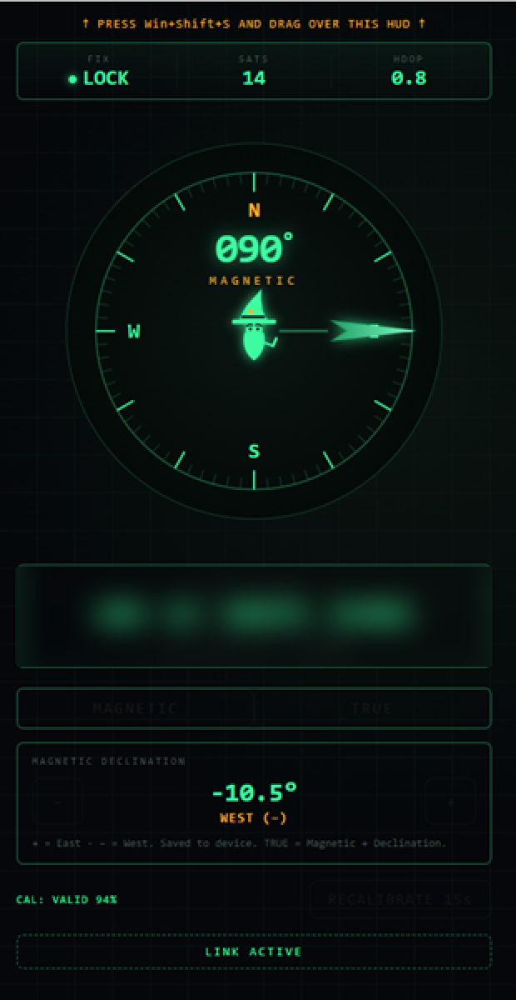

# GNSS Wizard HUD

Built to be the poor man's antenna tracker.  A tactical web-based HUD for field navigation, running on an ESP32. It creates its own Wi-Fi access point — no router needed. Connect any phone or tablet, open a browser, and get a live compass, MGRS grid, and GPS status on a phosphor-green display.  Connect this to any FPV Video Rx Antenna mounted to a tripod and get instant magnetic azimuth to align your VRX to the drone while in flight. Next phase is to get this into ATAK.



---

## What It Does

- **Hosts its own Wi-Fi AP** — open network called `GNSS-WIZARD`, no password required
- **Web HUD at `http://192.168.4.1`** — works on any phone or tablet browser
- **Live compass** with magnetic heading, needle animation, and a wizard avatar at center
- **MGRS grid coordinates** computed on-device from GPS lat/lon
- **GPS status** — fix indicator, satellite count, and HDOP accuracy rating
- **Magnetic declination** — configurable in 0.5° steps, saved to device flash; TRUE heading toggle applies it
- **Magnetometer calibration** — 15-second spin calibration with quality gate (coverage + axis ratio checks)
- **Interference detection** — flags anomalies when the live field deviates >30% from the calibrated radius

---

## Hardware

| Component | Part |
|---|---|
| Microcontroller | ESP32 Dev Module |
| GPS | ARK DAN L1/L5 (6-pin JST-GH):https://arkelectron.com/product/ark-dan-gps/?srsltid=AfmBOooCBRMHwuc0bTSjqSHMJOUh5banI0EsZEUVEgZBW8FhMQMXiwPm |
|Wifi Controlled Pan and Tilt Tripod unit | https://www.bhphotovideo.com/c/product/1880999-REG/bescor_mp101w_motorized_pan_head_with.html |

### Wiring

```
ARK DAN L1/L5 (6-pin JST-GH)       ESP32 Dev Module
─────────────────────────────       ────────────────
5V   ──────────────────────────►    VIN
GND  ──────────────────────────►    GND
TX   ──────────────────────────►    GPIO 16  (RX2)
RX   ──────────────────────────►    GPIO 17  (TX2)
SCL  ──────────────────────────►    GPIO 22  (I2C SCL)
SDA  ──────────────────────────►    GPIO 21  (I2C SDA)
```

- GPS baud rate: **38400**
- Magnetometer I2C address: **0x1E**

---

## Software Setup

### Requirements

- [Arduino IDE](https://www.arduino.cc/en/software)
- **Board:** ESP32 Dev Module (install via Boards Manager: `esp32` by Espressif)
- **Library:** [TinyGPSPlus](https://github.com/mikalhart/TinyGPSPlus) by Mikal Hart (install via Library Manager)

### Flash Instructions

1. Open `GNSS_Wizard_HUD_1/GNSS_Wizard_HUD_1.ino` in Arduino IDE
2. Select **Board:** `ESP32 Dev Module`
3. Select the correct COM port for your ESP32
4. If the upload fails, hold the **BOOT** button on the ESP32 during upload
5. Upload speed: `115200`

> **Partition note:** The default partition scheme should fit. If you get a "binary too large" error, switch to **No OTA (2MB APP / 2MB SPIFFS)** under Tools → Partition Scheme.

---

## Usage

1. Power on the ESP32
2. On your phone or tablet, connect to Wi-Fi network: **`GNSS-WIZARD`** (no password)
3. Open a browser and go to: **`http://192.168.4.1`**
4. On first boot with no saved calibration, the device will prompt you to rotate it — hold it level and spin it in a full circle for 15 seconds

### Calibration

Tap **RECALIBRATE 15s** on the HUD, then rotate the device level through a full 360° circle. The calibration is saved to flash and persists across power cycles. The quality gate requires ≥70% circle coverage and a sane axis ratio — if rejected, the previous good calibration is kept.

### Magnetic Declination

Use the `+` / `−` buttons to set your local declination (look it up at [NOAA's calculator](https://www.ngdc.noaa.gov/geomag/calculators/magcalc.shtml)). Toggle **TRUE** to apply it to the displayed heading. The value is saved to the device.

---

## Troubleshooting

| Symptom | Likely Cause | Fix |
|---|---|---|
| Heading always -1 or frozen | Magnetometer not found on I2C | Reseat SDA/SCL solder joints |
| No GPS fix | Wrong baud rate or TX/RX swapped | Swap GPIO 16 and 17 |
| Won't upload | ESP32 not in bootloader mode | Hold BOOT button during upload |
| Binary too large | Default partition too small | Switch to "No OTA (2MB APP / 2MB SPIFFS)" |
| Compass spins backwards | Magnetometer remounted with different orientation | Flip the `-cy` sign in `getAzimuth()` |

---

## License

MIT License — see [LICENSE](LICENSE) for full text.  
Copyright © 2026 Vaporware1

---

## Contributors

- **Vaporware1** — hardware design, firmware, and HUD
- **Claude** (Anthropic) — development assistance via [Claude Code](https://claude.ai/code)
